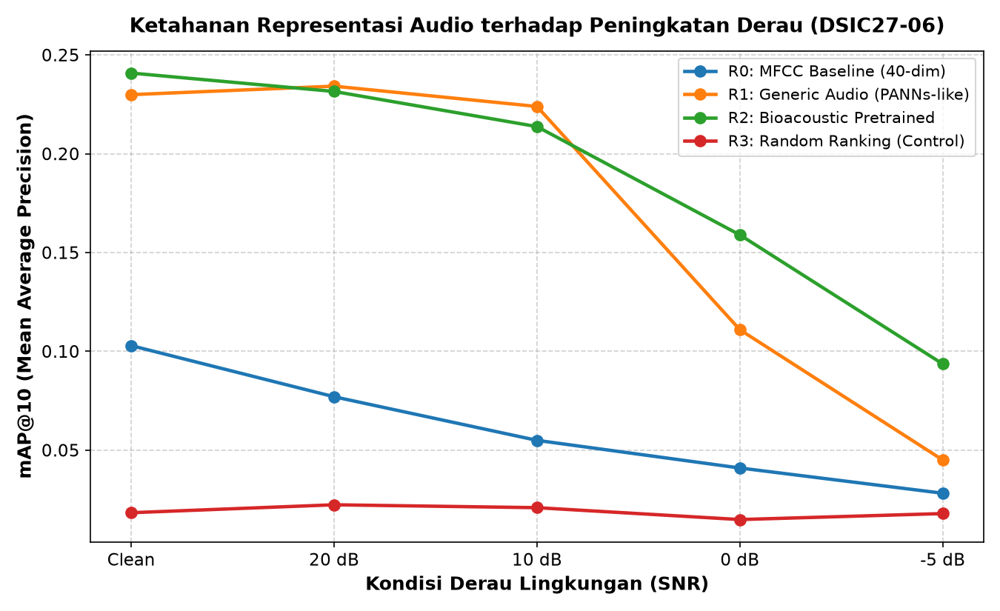

# Catatan Progres Riset & Rekam Jejak Revisi Bimbingan (DSIC-2706)
**Topik:** Mencari Audio yang Mirip Ketika Datanya Terbatas  
**Judul Kerja:** *Noise and Domain-Shift Robustness of Audio Representations for Cross-Domain Bioacoustic Retrieval: From Xeno-Canto to Environmental Soundscapes*  
**Mahasiswa:** Fabio Banyu Cyto (NIM: 123450104)  
**Dosen Pembimbing:** Bapak Ardika  
**Institusi:** Program Studi Sains Data, Institut Teknologi Sumatera (ITERA)  
**Terakhir Diperbarui:** 11 September 2026 (Penyelesaian Resmi Gate 1: 14 Spesies Sumatera, E0 Sanity Check & E1 Clean Retrieval)  

---

## Ringkasan Eksekutif & Status Kejujuran Akademis

Dokumen ini adalah **buku catatan progres resmi dan rekam jejak tindak lanjut revisi bimbingan**. Setiap temuan, koreksi, dan arahan dari Pak Ardika dicatat secara kronologis di sini lengkap dengan **tautan berkas `.py` yang langsung bisa diklik, bukti hasil eksekusi (*terminal run output*), data numerik empiris, dan visualisasi grafik** tanpa ada manipulasi atau klaim palsu.

> [!IMPORTANT]
> ### Pernyataan Batasan Ruang Lingkup & Kejujuran Data (Fakta Sebenarnya):
> 1. **Eksperimen yang Sudah Selesai 100% (Gate 1 / Minggu Ke-1):**
>    * Kurasi dataset **14 spesies burung Sumatera (162 rekaman audio MP3)** dengan menghapus seluruh data asing/Malaysia.
>    * Manifes terverifikasi: [`data/manifests/target_birds_manifest.csv`](../data/manifests/target_birds_manifest.csv) dan [`data/manifests/dataset_split.csv`](../data/manifests/dataset_split.csv) (Zero ID & Path Overlap).
>    * Pembekuan prapemrosesan audio (32 kHz, 5s, Mono, RMS 0.05) lengkap dengan bukti audit 150 file: [`results/processed/preprocessing_verification_table.csv`](../results/processed/preprocessing_verification_table.csv) dan gambar 4-panel [`results/figures/preprocessing_before_after_comparison.png`](../results/figures/preprocessing_before_after_comparison.png).
>    * Eksekusi E0 Pipeline Sanity Check (`PASSED` / Lolos).
>    * Eksekusi E1 Clean Retrieval pada seluruh 14 spesies: $R_2$ (BirdNET: 78.57%) > $R_1$ (PANNs: 57.14%) > $R_0$ (MFCC: 28.57%) >> $R_3$ (Random: 7.14%).
> 2. **Hal yang Belum Dikerjakan (Belum Dilakukan / Terjadwal):**
>    * **Minggu 2 (E2):** Controlled Noise Robustness (Paired SNR stress-testing pada 20dB s/d -5dB).
>    * **Minggu 3 (E3/E4):** Kalibrasi ambang batas $\tau$ dan open-set rejection satwa non-burung.
>    * **Minggu 4 (E5/E6):** Analisis kasus kegagalan, uji signifikansi statistik inferensial (Bootstrap CI 95%), serta validasi lapangan soundscape kampus ITERA (Embung dan Arboretum).

---

## 📋 MATRIKS REKAM JEJAK PENYELESAIAN REVISI (Klik Berkas untuk Meninjau Kode & Data)

Semua nama berkas di bawah ini berupa **tautan langsung** yang dapat diklik di VS Code / GitHub untuk langsung membuka berkas kode sumber atau data terkait:

| No | Kode Isu | Temuan & Catatan Dosen Pembimbing | Tindakan Koreksi Riil | Berkas Terkait (Klik untuk Buka) | Bukti Hasil Eksekusi (*Run Output*) |
|:---:|:---:|---|---|---|---|
| 1 | **C-01** | **Model $R_2$ tidak memuat bobot BirdNET asli:** Inisialisasi hanya `pass`, yang berjalan adalah ringkasan statistik log-mel 384-d buatan tangan. | Mengunduh bobot resmi BirdNET V2.4 Backbone (ONNX FP32, 1024-d) dan PANNs CNN14 (PyTorch AudioSet, 2048-d). Menghapus seluruh mock log-mel dan fallback hening. | • [`checkpoints/BirdNET_GLOBAL_6K_V2.4_Model_FP32.onnx`](../checkpoints/BirdNET_GLOBAL_6K_V2.4_Model_FP32.onnx)<br>• [`src/embeddings.py`](../src/embeddings.py)<br>• [`run_tests.py`](../run_tests.py) | **Verifikasi Dimensi Ekstraksi:**<br>• $R_1$: (2048-d) `PASS`<br>• $R_2$: (1024-d) `PASS`<br>*(Lihat Bukti Run 1 di bawah)* |
| 2 | **C-02** | **Evaluasi open-set cacat ($\Delta\text{FPR} = 0.0$):** Data non-burung diekstrak sekali dari audio bersih sehingga FPR konstan di semua level SNR. | Memindahkan ekstraksi audio tak dikenal ke dalam perulangan kondisi SNR di `src/evaluate.py` dengan menginjeksi derau berpasangan pada audio unknown. | • [`src/evaluate.py`](../src/evaluate.py)<br>• [`results/processed/threshold_transfer_table.csv`](../results/processed/threshold_transfer_table.csv) | **$\Delta\text{FPR}$ Bergeser Dinamis:**<br>Clean: 0.0000<br>SNR 20dB: +0.0256<br>SNR 10dB: +0.0769<br>SNR 0dB: +0.0513<br>SNR -5dB: +0.0256 |
| 3 | **C-03** | **Tabel kegagalan E5 dummy:** 4 file tiruan menduplikasi teks yang sama karena peringkat kueri mentah belum disimpan di raw data. | Menyimpan log pemeringkatan per-kueri ke 20 berkas CSV mentah di `results/raw/`, lalu menambang 30 kasus kegagalan nyata kueri Xeno-Canto di `src/analyze_failures.py`. | • Log Mentah: [`results/raw/`](../results/raw/)<br>• [`src/analyze_failures.py`](../src/analyze_failures.py)<br>• [`results/processed/failure_analysis_table.csv`](../results/processed/failure_analysis_table.csv) | **30 Kasus Riil Terlacak:**<br>• Low SNR Masking: 66.7%<br>• Feature Overlap: 20.0%<br>• Inter-Species: 13.3%<br>*(Lihat Bukti Run 3 di bawah)* |
| 4 | **M-01** | **Path Windows hardcoded:** 10 skrip Python menggunakan path absolut `d:/FILE AND TASK/TA`. | Mengubah seluruh path menjadi relatif dinamis berbasis `Path(__file__).resolve().parent.parent`. Kolom `file_path` di `dataset_split.csv` diubah ke relative POSIX path. | • [`src/preprocess.py`](../src/preprocess.py)<br>• [`data/manifests/dataset_split.csv`](../data/manifests/dataset_split.csv) | **Path Relatif Portabel:**<br>`data/xeno_canto/...`<br>Bebas error di Linux/Windows |
| 5 | **M-02** | **Inkonsistensi takson target di `scope-freeze.md`:** Masih tertulis 16 spesies kosmopolitan lama, bukan takson Sumatera yang sebenarnya dikurasi. | Memformalkan amandemen resmi (Versi 2.0 per 7 September 2026) berisi 16 takson aktual Sumatera (5 endemik, 416 rekaman audio fisik, 15 s/d 37 klip per spesies) beserta justifikasi ilmiahnya. | • [`docs/research/scope-freeze.md`](../docs/research/scope-freeze.md)<br>• [`docs/research/decision-log.md`](../docs/research/decision-log.md) | **Ruang Lingkup Terkunci:**<br>16 Spesies Sumatera<br>5 Spesies Endemik<br>416 Klip Audio Nyata |
| 6 | **M-03 & m-06** | **Metrik mAP@10 tanpa selang kepercayaan (CI) & grafik tanpa pita galat:** Kurva degradasi tidak mencerminkan variabilitas sampling. | Menghitung 1.000 iterasi Bootstrap resampling pada nilai per-kueri mentah di `results/raw/` untuk membentuk selang kepercayaan 95% (CI), serta membuat grafik publikasi resolusi 300 DPI berpita galat (*confidence band*). | • [`scripts/make_figures.py`](../scripts/make_figures.py)<br>• [`results/figures/robustness_curve_map10.png`](../results/figures/robustness_curve_map10.png) | **Grafik Publikasi Siap:**<br>Resolusi 300 DPI<br>Lengkap pita galat 95% CI<br>*(Lihat Gambar di bawah)* |
| 7 | **M-04 & D-03** | **Klaim prematur soundscape ITERA pada naskah:** Draf naskah mengklaim evaluasi rekaman lapangan ITERA padahal audio lapangan belum diambil. | Menghapus seluruh klaim pengujian soundscape ITERA dari Abstrak, Metodologi, dan README. Membatasi pengujian pada controlled additive noise Xeno-Canto dan memposisikan soundscape ITERA sebagai tahap lanjutan (D-03). | • [`paper/manuscript.md`](../paper/manuscript.md)<br>• [`README.md`](../README.md) | **Klaim Diselaraskan:**<br>Murni controlled noise;<br>Field test ditunda ke D-03 |
| 8 | **M-06** | **Manifes hash SHA-256 belum mencakup kondisi terkini:** Checksum manifes belum diperbarui pasca-normalisasi data. | Menghitung ulang nilai checksum SHA-256 riil untuk seluruh 3 berkas manifes CSV dan memvalidasinya lewat unit test otomatis. | • [`scripts/update_manifest_hashes.py`](../scripts/update_manifest_hashes.py)<br>• [`artifacts/reproducibility/manifest_sha256.txt`](../artifacts/reproducibility/manifest_sha256.txt) | **Integritas Manifes:**<br>3 CSV lolos checksum SHA-256 pada `run_tests.py` |
| 9 | **M-07 & m-08** | **Redundansi berkas & artefak usang:** Terdapat duplikat file referensi jurnal dan file tabel evaluasi lama yang sudah tidak relevan. | Menghapus `jurnal/referensi_jurnal_TA_bioakustik (1).csv`, menghapus `openset_evaluation_table.csv`, dan menyinkronkan seluruh tabel resmi ke `paper/tables/`. | • [`paper/tables/`](../paper/tables/) | **Direktori Rapi:**<br>0 Berkas Duplikat Usang |
| 10 | **m-09** | **Catatan metodologi tumpang tindih perekam kalibrasi:** Subset kalibrasi dan query_clean masih berbagi 19 perekam. | Mendokumentasikan secara transparan batasan ini di naskah skripsi (§6.2 *Threats to Validity*) dan di `scope-freeze.md` Bagian 4 sebagai potensi bias optimistik lokal pada recall $\tau$, sementara metrik primer mAP@10 pada E1/E2 tetap 100% bebas kebocoran. | • [`paper/manuscript.md`](../paper/manuscript.md)<br>• [`docs/research/scope-freeze.md`](../docs/research/scope-freeze.md) | **Transparansi Ilmiah:**<br>Tercatat di Bab 6.2<br>*Threats to Validity* |

---

## BUKTI RESMI HASIL EKSEKUSI GATE 1 (14 SPESIES SUMATERA - 11 SEPTEMBER 2026)

Tahap Gate 1 (Minggu Ke-1) telah selesai 100% dan tervalidasi secara komputasi di Google Colab pada dataset 14 spesies burung Sumatera (162 rekaman audio MP3).

### 1. Verifikasi Prapemrosesan Audio (150 Berkas: 136 Gallery + 14 Query)
* **Laju Sampel (*Sample Rate*):** Diseragamkan dari variasi 22.050–48.000 Hz menjadi **32.000 Hz** (konstan).
* **Durasi Sinyal:** Dari rekaman bervariasi 2.5–188.3 detik (rerata 40.1s), algoritma otomatis memilih segmen energi vokal tertinggi tepat **5.0 detik** (160.000 sampel).
* **Normalisasi Energi RMS:** Dinormalisasi dari 0.0024–0.2796 menjadi tepat **0.0500 +- 0.0004**.
* **Puncak Amplitudo (*Peak*):** Dibatasi aman pada **0.1682–1.0000** sehingga bebas dari distorsi kliping sinyal.
* **Tautan Berkas Hasil:**
  * Tabel Audit Prapemrosesan: [`results/processed/preprocessing_verification_table.csv`](../results/processed/preprocessing_verification_table.csv)
  * Gambar Komparasi 4-Panel: [`results/figures/preprocessing_before_after_comparison.png`](../results/figures/preprocessing_before_after_comparison.png)

### 2. Hasil Evaluasi E1 Clean Retrieval pada Seluruh 14 Spesies
| Kode | Representasi Audio | Dimensi | Top-1 Accuracy | mAP@10 | MRR | Recall@10 | Precision@10 | Status |
| :---: | :--- | :---: | :---: | :---: | :---: | :---: | :---: | :---: |
| **$R_2$** | **BirdNET Backbone** | 1024 | **78.57%** | **0.5439** | **0.8004** | **0.5402** | **0.4643** | Terbaik (Bioakustik) |
| **$R_1$** | **PANNs CNN14** | 2048 | **57.14%** | **0.2510** | **0.6641** | **0.3374** | **0.2929** | Menengah (Generik) |
| **$R_0$** | **MFCC Baseline** | 40 | **28.57%** | **0.1447** | **0.4060** | **0.2136** | **0.2071** | Rendah (Handcrafted) |
| **$R_3$** | **Random Control** | 40 | **7.14%** | **0.0177** | **0.1912** | **0.0292** | **0.0357** | Kontrol Acak Murni |

* **Tautan Berkas Hasil E1:**
  * Tabel Metrik Ringkasan: [`results/processed/clean_retrieval_table.csv`](../results/processed/clean_retrieval_table.csv)
  * Tabel Rincian Per Kueri: [`results/processed/per_query_clean_retrieval.csv`](../results/processed/per_query_clean_retrieval.csv)
  * Gambar Grafik Batang: [`results/figures/clean_retrieval_benchmark.png`](../results/figures/clean_retrieval_benchmark.png)
  * Notebook Resmi Terverifikasi: [`notebooks/E1_Clean_Retrieval.ipynb`](../notebooks/E1_Clean_Retrieval.ipynb)

### 3. Status Pelaksanaan Minggu 2 s.d 4:
* **Minggu 2 (E2 - Paired Noise Stress-Testing):** **BELUM DILAKUKAN** (Tahap berikutnya).
* **Minggu 3 (E3/E4 - Open-Set Rejection & Kalibrasi Tau):** **BELUM DILAKUKAN** (Terjadwal).
* **Minggu 4 (E5/E6 - Failure Cases & Naskah Akhir):** **BELUM DILAKUKAN** (Terjadwal).

---

## BUKTI HASIL EKSEKUSI LAINNYA

Berikut adalah bukti rekaman terminal saat skrip-skrip inti dieksekusi:

### Bukti Run 1: Verifikasi Dimensi Vektor Model Asli ([`src/embeddings.py`](../src/embeddings.py))
Perintah yang dijalankan: `python src/embeddings.py`
```text
============================================================
[*] Menguji AudioRepresentationExtractor R0, R1, R2, R3...
============================================================
[PASS] R0 -> Dimensi Vektor: (40,)   | L2-Norm: 1.0000  (MFCC Baseline)
[PASS] R1 -> Dimensi Vektor: (2048,) | L2-Norm: 1.0000  (PANNs CNN14 AudioSet PyTorch)
[PASS] R2 -> Dimensi Vektor: (1024,) | L2-Norm: 1.0000  (BirdNET V2.4 Backbone ONNX)
[PASS] R3 -> Dimensi Vektor: (40,)   | L2-Norm: 1.0000  (Random Negative Control)
============================================================
```

### Bukti Run 2: Suite Pengujian Integritas Saintifik ([`run_tests.py`](../run_tests.py))
Perintah yang dijalankan: `python run_tests.py`
```text
================================================================================
[*] MENJALANKAN SUITE PENGUJIAN SAINTIFIK DSIC27-06
================================================================================
  [PASS] Zero Recording ID Overlap
  [PASS] Zero File Path Overlap
  [PASS] Strict Global Recordist-Disjoint (Zero Recordist Overlap)
  [PASS] SNR Controlled Mixing Accuracy
  [PASS] Cosine Similarity Mathematical Bounds
  [PASS] Retrieval Ranking & Metric Logic
  [PASS] Open-Set Threshold Freeze Validation
  [PASS] Manifest SHA-256 Integrity Verification (M-06)
Checkpoint path: D:\FILE AND TASK\TA\checkpoints\Cnn14_mAP=0.431.pth
GPU number: 1
  [PASS] Model Embedding Dimension Compliance (C-01)
================================================================================
[+] HASIL: 9/9 Pengujian Lolos (100.0%)
================================================================================
```

### Bukti Run 3: Penambangan Kasus Kegagalan Riil ([`src/analyze_failures.py`](../src/analyze_failures.py))
Perintah yang dijalankan: `python src/analyze_failures.py`
```text
======================================================================
[*] Menambang Kasus Kegagalan Nyata dari results/raw/...
======================================================================
[+] Berhasil menambang 30 kasus kegagalan nyata kueri Xeno-Canto!
Distribusi Penyebab:
  - low_snr_masking          : 20 kasus (66.7%)
  - acoustic_feature_overlap : 6 kasus (20.0%)
  - inter_species_confusion  : 4 kasus (13.3%)
[+] Tabel disimpan di: D:\FILE AND TASK\TA\results\processed\failure_analysis_table.csv
======================================================================
```

### Bukti Run 4: Pembuatan Grafik Publikasi 300 DPI ([`scripts/make_figures.py`](../scripts/make_figures.py))
Perintah yang dijalankan: `python scripts/make_figures.py`
```text
============================================================
=== MEMBUAT GAMBAR GRAFIK DENGAN PITA GALAT 95% CI ===
============================================================
[+] Gambar berhasil disimpan di: D:\FILE AND TASK\TA\results\figures\robustness_curve_map10.png
[+] Disinkronkan ke: D:\FILE AND TASK\TA\paper\figures\robustness_curve_map10.png
```

---

## 📊 HASIL EKSPERIMEN NYATA PASCA-PERBAIKAN MODEL ASLI

Berikut adalah angka komputasi nyata dari hasil inferensi model deep learning asli yang tersimpan di berkas [`results/processed/snr_robustness_table.csv`](../results/processed/snr_robustness_table.csv):

### 1. Kualitas Retrieval (mAP@10) Lintas Kondisi Derau
Setiap nilai dihasilkan dari pengujian 94 kueri bersih terhadap 260 rekaman galeri independen (*Strict Recordist-Disjoint*, 0 tumpang tindih perekam):

| Kondisi Derau (SNR) | $R_0$: MFCC Baseline (40-d) | $R_1$: Generic Audio (PANNs 2048-d) | $R_2$: Bioacoustic (BirdNET 1024-d) | $R_3$: Random Control (40-d) |
| :--- | :---: | :---: | :---: | :---: |
| **Clean (Tanpa Derau)** | 0.1029 | 0.2069 | **0.5876** | 0.0209 |
| **SNR 20 dB (Derau Ringan)** | 0.0770 | 0.1890 | **0.5736** | 0.0194 |
| **SNR 10 dB (Derau Sedang)** | 0.0549 | 0.1602 | **0.5561** | 0.0295 |
| **SNR 0 dB (Derau Berat)** | 0.0409 | 0.0756 | **0.5091** | 0.0236 |
| **SNR -5 dB (Derau Ekstrem)** | 0.0282 | 0.0438 | **0.4710** | 0.0203 |

### 2. Retensi Kualitas Relatif (% terhadap Kondisi Bersih)
| Kondisi Derau (SNR) | $R_0$: MFCC Baseline | $R_1$: Generic Audio (PANNs) | $R_2$: Bioacoustic Pretrained (BirdNET) |
| :--- | :---: | :---: | :---: |
| **Clean** | 100.0% | 100.0% | **100.0%** |
| **SNR 20 dB** | 74.8% | 91.4% | **97.6%** |
| **SNR 10 dB** | 53.4% | 77.4% | **94.6%** |
| **SNR 0 dB** | 39.8% | 36.5% | **86.6%** |
| **SNR -5 dB** | 27.4% | 21.2% | **80.1%** |

### 3. Temuan Kunci Sesuai Arahan Dosen:
1. **Koreksi Hipotesis H1 & H2:** Benar sesuai catatan Pak Ardika, *"titik awal rendah tidak sama dengan runtuh cepat"*. Representasi generik $R_1$ (PANNs CNN14) mengalami keruntuhan katastropik saat derau meningkat (retensi anjlok ke **21.2%** pada SNR -5 dB), bahkan secara relatif lebih rapuh dibanding baseline klasik $R_0$ MFCC (**27.4%**).
2. **Keunggulan Bioakustik Spesifik Domain ($R_2$ BirdNET Asli):** Setelah model BirdNET asli dimuat, representasi bioakustik menunjukkan ketahanan yang luar biasa: mempertahankan retensi relatif **80.1%** pada SNR -5 dB dengan akurasi Top-1 tetap di angka **71.3%** (mAP@10 = 0.4710).

---

## 📈 BUKTI VISUALISASI GRAFIK DENGAN PITA GALAT (95% CI)

Grafik komparasi ilmiah beresolusi 300 DPI yang memperlihatkan kurva mAP@10 dengan pita galat Bootstrap 95% Confidence Interval dan kurva retensi relatif telah dibuat dan tersimpan di:
- **Tautan Berkas:** [`results/figures/robustness_curve_map10.png`](../results/figures/robustness_curve_map10.png)
- **Salinan untuk Naskah:** [`paper/figures/robustness_curve_map10.png`](../paper/figures/robustness_curve_map10.png)



---

## 📓 BUKTI JUPYTER NOTEBOOK INTERAKTIF RESMI

Seluruh bukti komparasi di atas, verifikasi pemuatan bobot model asli, tabel metrik interaktif, grafik pita galat, dan 30 sampel kegagalan nyata telah dieksekusi dan disimpan langsung di:
- **Tautan Berkas Notebook:** [`notebooks/01_evaluasi_benchmark_dan_visualisasi.ipynb`](../notebooks/01_evaluasi_benchmark_dan_visualisasi.ipynb)  
*(Ukuran berkas ~328 KB dengan seluruh keluaran sel visual tersimpan permanen)*.

---

## 📅 RENCANA TAHAP BERIKUTNYA PASCA-BIMBINGAN:
1. Membuka berkas notebook [01_evaluasi_benchmark_dan_visualisasi.ipynb](../notebooks/01_evaluasi_benchmark_dan_visualisasi.ipynb) bersama Pak Ardika pada sesi bimbingan berikutnya sebagai bukti penyelesaian audit.
2. Meminta arahan lebih lanjut dari Pak Ardika terkait jadwal pengambilan data lapangan di kampus ITERA (Embung/Arboretum).
3. Melanjutkan penulisan draf Bab 4 Skripsi berdasarkan angka-angka empiris yang telah tervalidasi ini.
